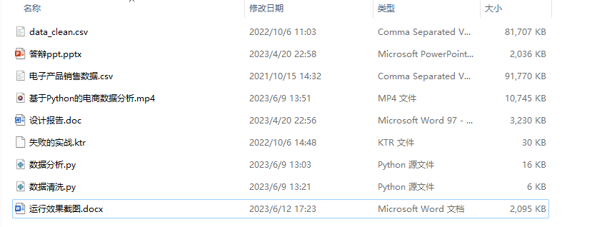
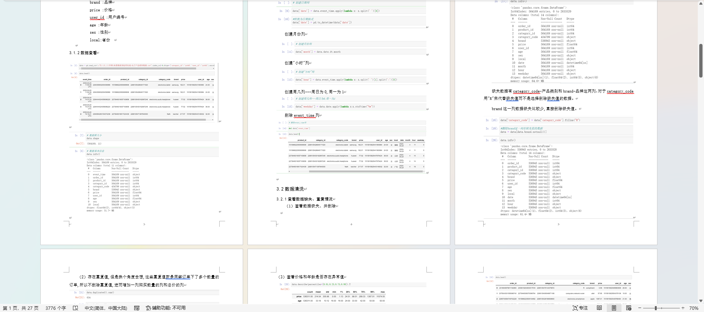
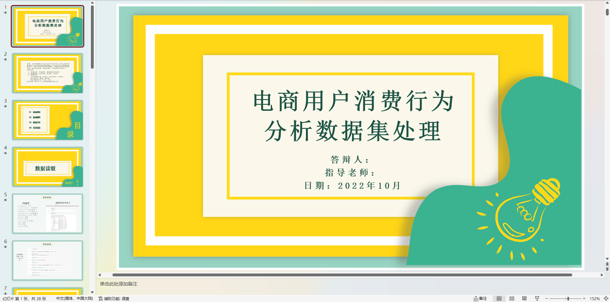
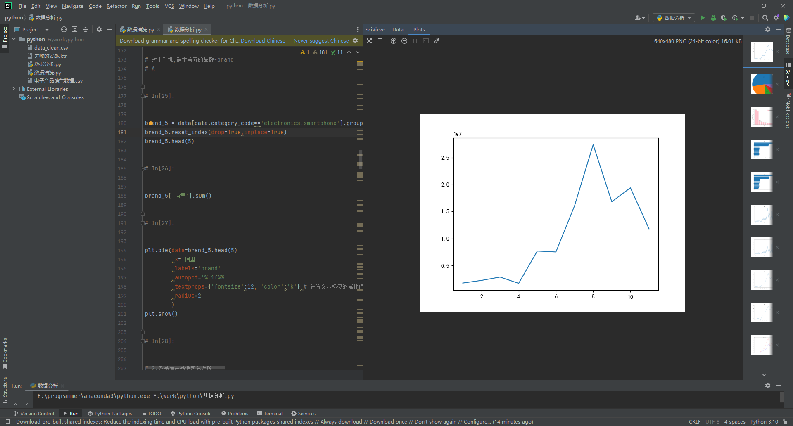
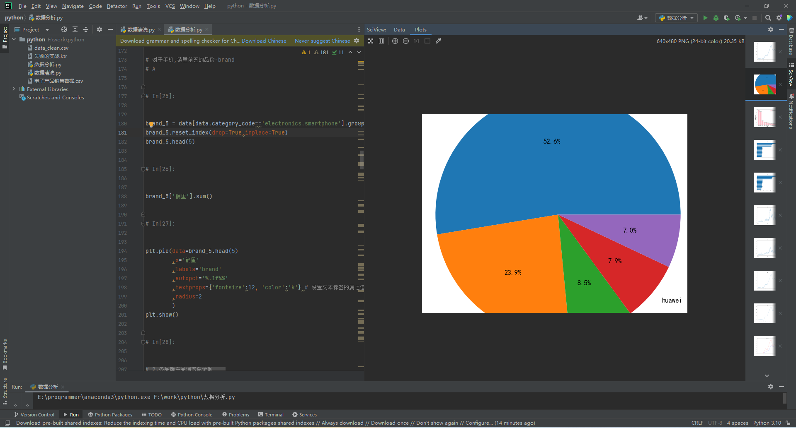

# 电商用户消费行为分析数据集处理   基于Python的电商数据分析

### 9.9￥ 获取完整源码+sql，需要加Q：3577148218 ,备用Q: 3808981644
### 有问题，或者需要协助调试运行项目的也可联系
### 获取更多项目，关注公众号：编程项目集

## 介绍
基于Python的电商数据分析  电商用户消费行为分析数据集处理

功能要求：数据读取，数据清洗，数据分析

开发工具：pycharm
使用的语言和技术栈：python语言、pandas、matplotlib

报告文档

ppt

## 部分代码运行界面

### 9.9￥ 获取完整源码+sql，需要加Q：3577148218 ,备用Q: 3808981644
### 有问题，或者需要协助调试运行项目的也可联系

